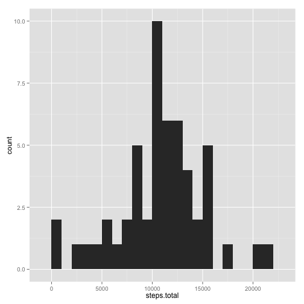
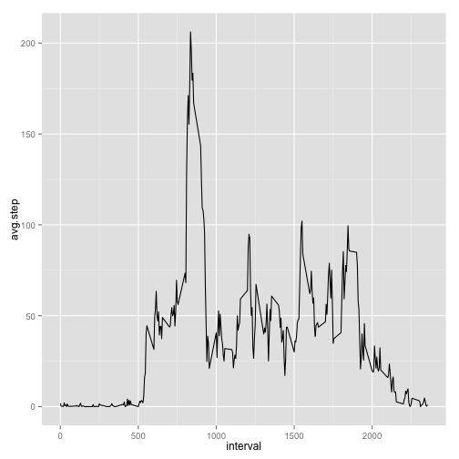
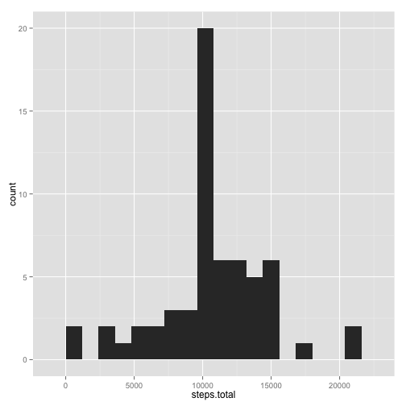
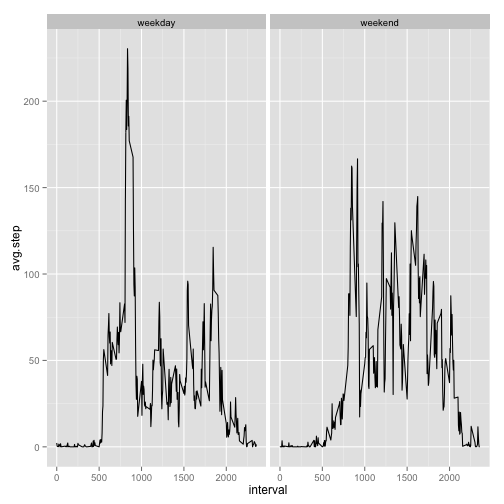

# Reproducible Research: Peer Assessment 1


##Loading and processing the data
First the data is loaded. In my analysis, data is transformed into data table and plots and done using ggplots. 
Because there are a lot of missing data (NAs), in the first part, I omit them and only deal with those that has true values.

```r
library(data.table)
data = read.csv('activity.csv')
dt.all = data.table(data)
dt = na.omit(dt.all)
dt$steps = as.numeric(dt$steps)
```

Define some functions that will be useful later

```r
library(ggplot2)
library(xtable)
plothist = function(datatable,binwidth){
    dt.sum = datatable[,list(steps.total=sum(steps)),by="date"]
    ggplot(dt.sum,aes(steps.total)) + geom_histogram(binwidth=binwidth)     
}

printsum = function(datatable){
    dt.sum = datatable[,list(steps.total=sum(steps)),by="date"]
    dt.statstics = data.frame(mean=mean(dt.sum$steps.total),median=median(dt.sum$steps.total))
    dt.table = xtable(dt.statstics)
    print(dt.table,type="html")
}
```

##What is mean total number of steps taken per day?
To understand the mean total number of steps taken per day, we first look at the histogram of total number of steps taken each day. We can see that the activity of the person has a wide distribution as some days over 20000 steps are taken and some other days are quiet unactive. When we omit the NA values, the mean and median are listed below.

```r
plothist(dt,binwidth=1000)
```

 

```r
printsum(dt)
```

<!-- html table generated in R 3.1.1 by xtable 1.7-3 package -->
<!-- Thu Aug 14 23:53:40 2014 -->
<TABLE border=1>
<TR> <TH>  </TH> <TH> mean </TH> <TH> median </TH>  </TR>
  <TR> <TD align="right"> 1 </TD> <TD align="right"> 10766.19 </TD> <TD align="right"> 10765.00 </TD> </TR>
   </TABLE>

##What is the average daily activity pattern?
From the data with true values, the average number of steps per interval is plotted. We can see that activity level peaks during a few intervals.

```r
step.sum = dt[,list(avg.step = mean(steps),med.step = median(steps)),by="interval"]
ggplot(step.sum,aes(x=interval,y=avg.step)) + geom_line()
```

 

##Imputing missing values
In the second part, NAs are not going to be omitted. First, the number and distribution of NAs are explored. 

```r
dt.all = dt.all[,na_boolean := is.na(steps)]
na.num = sum(dt.all$na_boolean)
na.frac = na.num/length(dt.all$na_boolean)*100
steps = dt.all$steps
boolean = dt.all$na_boolean
for (i in 1:length(steps)){
    if(boolean[i]){
        steps[i] =step.sum$avg.step[which(step.sum$interval==dt.all$interval[i])]
    }
}
dt.all$steps.fill = steps
```
The total number of NAs is 2304, which is about 13.1148% of the whole data. I fill the NAs with the average step during the interval from the other days with true values.  

With the filled dataset, histogram of total steps per day is plotted. The differences are not that obvious. The mean doesn't really change; however, median changes. It is due to the filling method as we fill missing values with average steps of that particular interval.


```r
dt.all.fill = data.table(date = dt.all$date,interval = dt.all$interval, steps = dt.all$steps.fill)
plothist(dt.all.fill,binwidth=1200)
```

 

```r
printsum(dt.all.fill)
```

<!-- html table generated in R 3.1.1 by xtable 1.7-3 package -->
<!-- Thu Aug 14 23:53:41 2014 -->
<TABLE border=1>
<TR> <TH>  </TH> <TH> mean </TH> <TH> median </TH>  </TR>
  <TR> <TD align="right"> 1 </TD> <TD align="right"> 10766.19 </TD> <TD align="right"> 10766.19 </TD> </TR>
   </TABLE>

##Are there differences in activity patterns between weekdays and weekends?
To compare whether activity levels are different between weekday and weekend, additional values are assigned to each data point to label the day. The plot uses the complete data with missing data filled. As we can see from the plot, the activity patterns are very different between weekdays and weekends. There are more high peaks during weekdays. It seems like the person is not as active during weekends as during weekdays. 

```r
weekday_assign = function(datatable){
    weekday =  weekdays(as.Date(datatable$date))
    day = rep(0,length(weekday))
    for (i in 1:length(weekday)){
        if(weekday[i] %in% c("Saturday","Sunday")){
            day[i] = c("weekend")
        }
    else{
        day[i] = c("weekday")
        }
    }
    datatable$day =day
    return(datatable)
}

dt = weekday_assign(dt)
dt.all.fill = weekday_assign(dt.all.fill)

step.sum.fill.byday = dt.all.fill[,list(avg.step = mean(steps),med.step = median(steps)),by=c("interval","day")]
ggplot(step.sum.fill.byday,aes(x=interval,y=avg.step)) + geom_line() + facet_wrap(~day)
```

 


